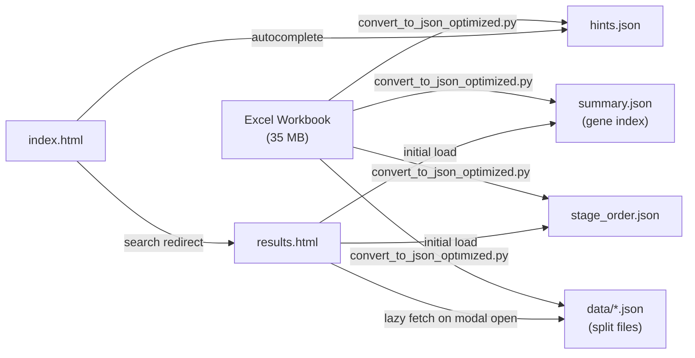

<p align="center">
  
  
  
  
  
  
</p>

# 🧬 ZF-GeneBridge

**A curated, ZFIN-derived zebrafish gene-expression and annotation database linking stage- and tissue-resolved wild-type expression to human disease via orthology and Gene Ontology annotations.**

> _Last updated: **2026-05-19** · Source: [ZFIN — Zebrafish Information Network](https://zfin.org)_

---

## ✨ What is ZF-GeneBridge?

ZF-GeneBridge brings together five layers of zebrafish gene annotation — **developmental stage order**, **expression summaries**, **evidence-level expression records**, **human disease orthology**, and **Gene Ontology** — into a single, searchable web interface and structured dataset.

Instead of navigating multiple ZFIN query forms, you get a unified local tool where you can:

- 🔍 **Search** any gene by symbol, name, or ZFIN ID
- 📊 **Filter** by developmental stage range, tissue, fish line — and exclude unwanted tissues
- 🧬 **View** a detailed gene context card with GO annotations, developmental timeline, human orthologs, and disease associations
- 📋 **Sort** results by gene name, tissue count, or developmental breadth
- 🌙 **Toggle** between light and dark modes

---

## 📊 Database at a Glance

| Metric | Value |
|--------|------:|
| Total genes cataloged | **24,007** |
| Developmental stages covered | **44** (Zygote → Adult) |
| Unique tissues / anatomical structures | **1,648** |
| Genes with GO annotations | **22,057** |
| Genes with human disease orthology | **5,759** |
| Wild-type fish lines represented | **22** |

---

## 🚀 Quick Start

### Option 1: Use the Web Interface (Recommended)

1. **Clone the repository**
   ```bash
   git clone https://github.com/RonnyAllen/ZF-GeneBridge.git
   cd ZF-GeneBridge
   ```

2. **Start a local server** (required for `fetch()` to work)
   ```bash
   # Python 3
   python -m http.server 8000
   ```

3. **Open in your browser**
   ```
   http://localhost:8000
   ```

4. **Search for a gene** — type a gene symbol (e.g., `tp53`, `sox10`, `pparg`) and explore.

### Option 2: Use the Raw Excel Workbook

Open `Latest_ZF_GeneExpression_Gene2Disease_GO_Collated.xlsx` in Excel, Google Sheets, R, or Python (pandas/openpyxl) for direct programmatic access to the source data.

---

## 🖥️ Web Interface Features

### 🔎 Search & Landing Page (`index.html`)

- **Smart autocomplete**: Type any gene symbol, name, or ZFIN ID — the search bar provides instant suggestions from all 24,007 genes.
- **Mode selector**: Choose between Expression, Disease, or GO search modes.
- **Premium design**: Clean, responsive layout with dark/light theme toggle.

### 📋 Results & Filtering Page (`results.html`)

The results page offers a powerful, interactive table of matching genes with advanced filtering and sorting:

#### Filters

| Filter | Type | Description |
|--------|------|-------------|
| **Gene / free text** | Text search | Matches gene symbol, ZFIN ID, or gene name (substring) |
| **Start stage (from)** | Dropdown | Set the earliest developmental stage of interest |
| **End stage (to)** | Dropdown | Set the latest developmental stage of interest |
| **Fish line** | Dropdown | Filter by wild-type strain (e.g., AB, TU, WIK) |
| **Include tissues** | Tag input + autocomplete | Gene must be expressed in **all** listed tissues (AND logic) |
| **Exclude tissues** | Tag input + autocomplete | Gene is hidden if expressed in **any** listed tissue (OR logic) |

> **Tissue autocomplete**: As you type, a dropdown suggests matching tissue names from the database. Click a suggestion or press Enter to add it as a tag. Comma-separated input is supported (e.g., `brain, eye, heart`). Each tag can be removed with the × button.

#### Sorting

Click any sortable column header to sort the results. Click again to reverse the direction.

| Column | First Click | Second Click |
|--------|------------|--------------|
| **Gene symbol & name** | A → Z | Z → A |
| **Expressed in (Tissue)** | Most tissues → fewest | Fewest → most |
| **Developmental span** | Most stages → fewest | Fewest → most |

#### Gene Context Modal

Click any gene in the results to open a detailed gene card that covers 80% of the screen:

| Section | Details |
|---------|---------|
| **Gene ID** | Clickable link to the gene's page on ZFIN |
| **Gene Symbol & Name** | Full marker name from the database |
| **Gene Ontology Annotations** | Table with GO term IDs (linked to [QuickGO](https://www.ebi.ac.uk/QuickGO/)), aspect (Biological Process / Molecular Function / Cellular Component) |
| **Developmental Timeline** | Visual segmented bar from Zygote to Adult — green segments = expressed, grey = not expressed. Hover for stage-by-stage details |
| **Tissues** | Complete list of anatomical structures where expression is detected |
| **Human Orthologs** | Orthologous human gene symbol(s), or "not known" |
| **Known Diseases** | DO/OMIM disease associations via orthology, or "not known" |
| **Expression matches in ZFIN** | Direct link to the gene's expression page on ZFIN |
| **Detailed Expression Table** | Chronologically sorted records: start stage, end stage, tissue, sub-structure, assay type, fish line, publication ID (linked to ZFIN) |

---

## 📁 Repository Structure

```
ZF-GeneBridge/
│
├── index.html                          # Search / landing page
├── results.html                        # Results, filters, sorting, gene modal
│
├── Latest_ZF_GeneExpression_Gene2      # Source Excel workbook (35 MB)
│   Disease_GO_Collated.xlsx
│
├── summary.json                        # Pre-compiled gene index (24,007 genes)
├── stage_order.json                    # Ordered list of 44 developmental stages
├── hints.json                          # Autocomplete search hints
│
├── data/                               # Split JSON files for lazy loading
│   ├── expression_a.json ... z.json    # Expression records by gene prefix
│   ├── go_a.json ... z.json            # GO annotations by gene prefix
│   └── disease_a.json ... z.json       # Disease/orthology by gene prefix
│
├── convert_to_json_optimized.py        # Excel → JSON compiler script
├── verify_pages.py                     # Database integrity checker
│
└── previous updates/                   # Archived earlier versions
```

---

## 🗂️ Source Workbook Structure

The Excel file contains five sheets:

| Sheet | Role | Key Fields |
|-------|------|-----------|
| **Stage Order** | Defines the 44-stage developmental sequence from Zygote (1-cell) to Adult | Stage name |
| **wtexpression_Summary** | Aggregated expression overview per gene × tissue × stage | Gene symbol, tissue, stage, evidence count |
| **zf_wt_expression** | Evidence-level wild-type expression records | Gene, tissue, sub-structure, stage, assay, strain, publication ID |
| **gene2DiseaseOrthology** | Zebrafish → human orthology with disease mapping | ZF gene, human ortholog, DO term, OMIM term |
| **GeneOntology** | GO annotations per gene | Gene, GO term ID, ontology aspect, evidence code |

---

## 🏗️ Architecture



The web interface uses a **two-phase loading** strategy:
1. **Eager load**: `summary.json` and `stage_order.json` are fetched on page load (~11 MB total). These power the results table and filters.
2. **Lazy load**: When a user clicks a gene, the detailed data (`expression_*.json`, `go_*.json`, `disease_*.json`) is fetched on demand by prefix letter, then cached for subsequent lookups.

---

## 🔧 Re-compiling the Database

If you update the source Excel file with newer data from ZFIN, regenerate all JSON files:

```bash
python convert_to_json_optimized.py
```

This will:
- Parse all five sheets from the Excel workbook
- Generate `summary.json`, `hints.json`, `stage_order.json`
- Split detailed data into `data/expression_*.json`, `data/go_*.json`, `data/disease_*.json` (one file per starting letter)

To verify the compiled database:

```bash
python verify_pages.py
```

---

## 📌 Data Source & Attribution

All underlying records were obtained from the **Zebrafish Information Network ([ZFIN](https://zfin.org))**, the principal *Danio rerio* model organism database.

### Citation

> **ZFIN** — Bradford, Y., et al. (2022). ZFIN: Enhancements and updates to the zebrafish model organism database. *Nucleic Acids Research*, 50(D1), D1136–D1144. https://doi.org/10.1093/nar/gkab890

### Attribution

> Data in this repository were compiled from the Zebrafish Information Network (ZFIN) and organized into a local resource integrating developmental stage order, wild-type gene expression, disease associations via orthology, and Gene Ontology annotations.

---

## ⚠️ Data Quality Notes

- The **expression summary** provides aggregated counts; the **detailed expression sheet** contains traceable, evidence-level observations. Analyses requiring assay type, publication source, or strain-specific context should use the detailed records.
- **Orthology-based disease mapping** is useful for prioritization but should not be treated as direct proof of conserved disease mechanism. Functional validation remains essential.
- **GO annotations** reflect ZFIN's curated and electronic annotations as of the last update date. Users performing enrichment analyses should check for updates from ZFIN directly.

---

## 🔬 Recommended Use Cases

| Use Case | Relevant Data |
|----------|---------------|
| Stage-specific expression profiling | Expression summary + Stage order |
| Tissue-specific gene discovery | Results filter (include/exclude tissues) |
| Human disease gene prioritization | Gene-to-disease orthology |
| GO enrichment / functional interpretation | Gene Ontology sheet |
| Assay-level evidence review | Detailed expression table in gene modal |
| Candidate gene list building | Combine all filters + sort by tissue count or span |

---

## 📋 Reproducibility

For reproducible analyses, document:

- The exact workbook filename and date
- All filters applied (stage range, tissues, fish line)
- Whether results are from summary-level or evidence-level data
- The version of any scripts used to parse the workbook

---

## 🗺️ Roadmap

- [ ] Parsed CSV exports for each sheet
- [ ] Formal data dictionary with column descriptions
- [ ] Batch export of filtered results (CSV/TSV download)
- [ ] Developmental expression heatmap visualization
- [ ] Disease-linked gene network view
- [ ] Automated ZFIN refresh pipeline with release-tagged snapshots

---

## 📄 License

This repository redistributes structured data from ZFIN. Please comply with [ZFIN's data use policies](https://zfin.org/warranty.html) when using this resource.

---

<p align="center">
  <sub>Built for the zebrafish research community · <a href="https://zfin.org">ZFIN</a> · <a href="https://github.com/RonnyAllen/ZF-GeneBridge">GitHub</a></sub>
</p>
